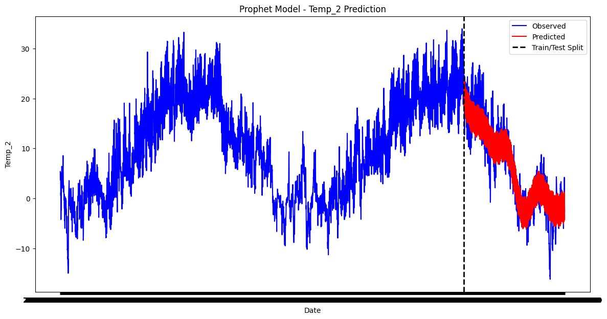
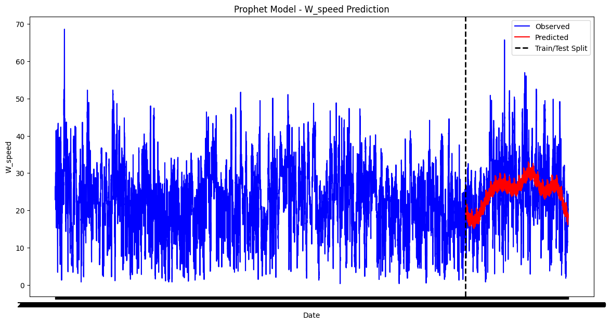

# Weather Forecasting System Documentation

## Objective
The objective of this project is to create a weather forecasting system using historical weather data obtained from an open-source API. The system includes data processing, model creation, and a Flask-based API to provide weather forecasts based on user input.

## Key Components and Workflow

### 1. Data Retrieval and Processing

- **Data Source**: The historical weather data is obtained from the [Open Meteo API](https://www.open-meteo.com/).
- **Data Storage**: The weather data is stored in CSV format for each city, containing information such as temperature, humidity, precipitation, and wind details.
- **City Information**: City information, including latitude and longitude, is stored in the list_of_cities.csv file. For model training, 24 regional centers of Ukraine have been selected as the primary cities. 

### 2. Model Training

#### OpenMeteo Data Processing
- The `openmeteo_requests` library is used to make requests to the Open Meteo API and retrieve historical weather data.
- Data processing involves extracting relevant weather variables such as temperature, humidity, and wind speed.

#### Model Creation using Prophet
- The Prophet library is employed to create time-series forecasting models for different weather variables.
- Each city has a separate folder in the 'models' directory, and within each folder, there are Prophet models trained for various weather variables (e.g., temperature, humidity).

#### Model Hyperparameters
- Optimized hyperparameters for each weather variable and city were determined through grid search with Cross-Validation (CV) and saved in `models_hyperparameters.csv`. This process preceded the model training.

#### Feature Engineering
- Lag variables (previous values) are added to the dataset to capture temporal patterns.
- Data is preprocessed and transformed to fit the Prophet model requirements.

### 3. Prediction

The prediction process accommodates two scenarios:

#### Case 1: Big City (Regional center)

For cities that either serve as regional centers or closely align with one, the system generates predictions using a set of forecasting models. These models are designed to capture regional weather patterns and provide forecasts for various weather variables.

#### Case 2: Non-Regional Center City

If the city's coordinates do not correspond to a regional center, the system employs a methodology based on proximity to nearby regional centers. It identifies the k (default 3) nearest regional centers using Haversine distance calculations. These centers serve as reference points to compute a weighted average for weather predictions. The weighting is based on the inverse of the distances, scaled to ensure a proper coefficient range.

This method helps the system make precise weather predictions for cities without dedicated models by considering the impact of nearby regional centers

### 4. Flask API for Weather Prediction

- A Flask application exposes a `/predict` endpoint to receive weather prediction requests.
- The endpoint accepts parameters such as `start_date`, `periods`, `latitude`, and `longitude`.
- If the location corresponds to a big city, the system provides weather forecasts directly from the trained Prophet models.
- For small cities, the system identifies nearby big cities, calculates weighted weather predictions, and returns the forecast.

## Model Accuracy and Data Visualization

### Performance Metrics

The accuracy of the weather forecasting models varies for different weather variables. Below are performance metrics for temperature (`temp_2`) in Kyiv and wind speed (`w_speed`) in Kharkiv:

- **Temperature (temp_2) in Kyiv:**
  - MAE: 2.67
  - MSE: 11.48
  - R2: 0.88

- **Wind Speed (w_speed) in Kharkiv:**
  - MAE: 6.79
  - MSE: 72.29
  - R2: 0.16

These metrics provide insights into the model's accuracy in predicting specific weather conditions. While the model performs well for temperature prediction, forecasting variables like wind speed can be more challenging, as indicated by the lower R2 value.

### Data Visualization

In the `models_testing.ipynb` notebook, visualizations demonstrate the model's performance on different weather variables. Here are two examples:

1. **Temperature Prediction in Kyiv:**
   

   The plot shows the observed temperature values in blue and the predicted values in red. The model achieves high accuracy in capturing temperature trends.

2. **Wind Speed Prediction in Kharkiv:**
   

   The plot illustrates the challenges in forecasting wind speed, with notable deviations between observed and predicted values.

These visualizations offer a comprehensive view of the model's strengths and challenges in predicting specific weather variables, aiding in the interpretation of performance metrics.

## Usage

1. **Data Loading**: Historical weather data is loaded using the Open Meteo API and stored in CSV files for each city.

2. **Model Training**: Prophet models are trained for each weather variable in each city, utilizing historical data and hyperparameters.

3. **Hyperparameter Tuning**: Adjust hyperparameters in the `models_hyperparameters.csv` file for optimal model performance.

4. **Endpoint Usage**:
   - Start the Flask application using `python app.py`.
   - Send HTTP GET requests to the `/predict` endpoint with parameters: `start_date`, `periods`, `latitude`, and `longitude`.
   - Receive JSON-formatted weather forecasts.

## Notes

- Ensure necessary Python libraries are installed by using `pip install -r requirements.txt`.
- The system utilizes the Prophet library for time-series forecasting, and the Flask framework for API development.
- Hyperparameter tuning may be necessary for optimal model performance.

## Conclusion

This weather forecasting system integrates data processing, model training, and an API to deliver accurate weather predictions for both big and small cities. The use of the Prophet library facilitates time-series forecasting, and the Flask API makes the predictions accessible for external applications.
